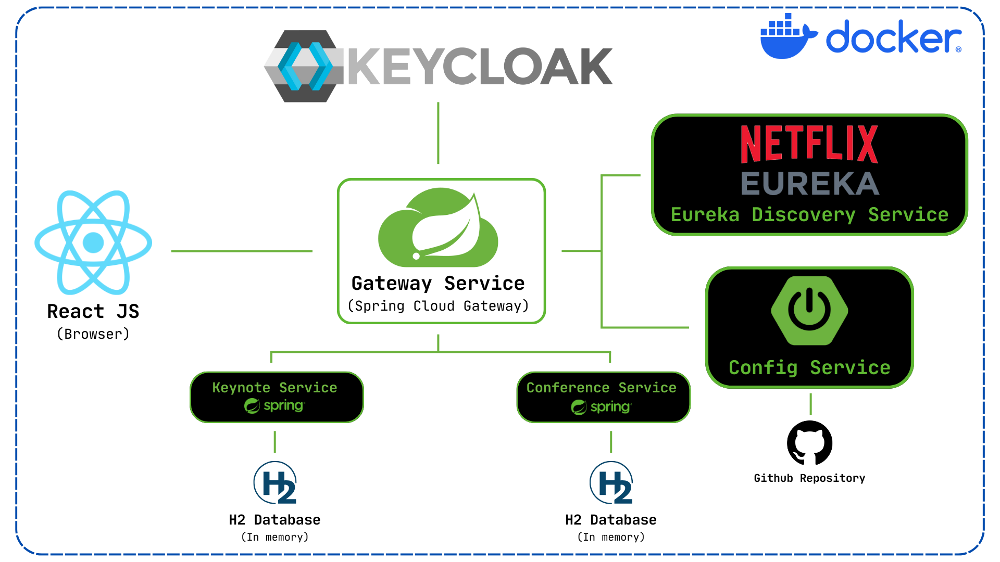
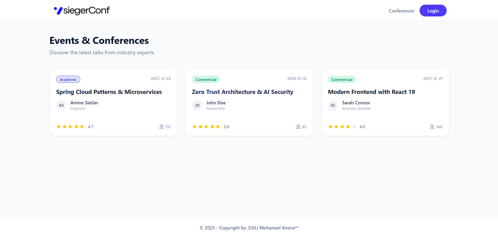
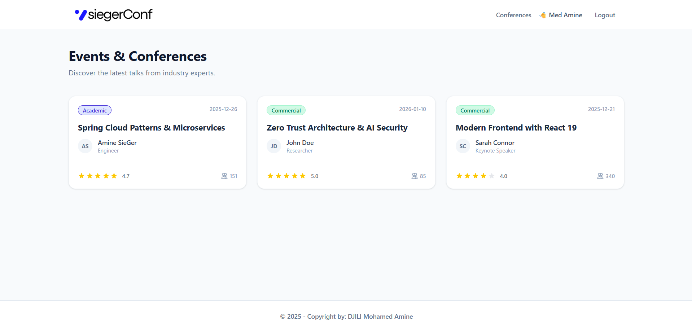
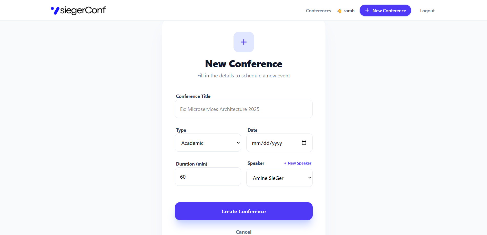
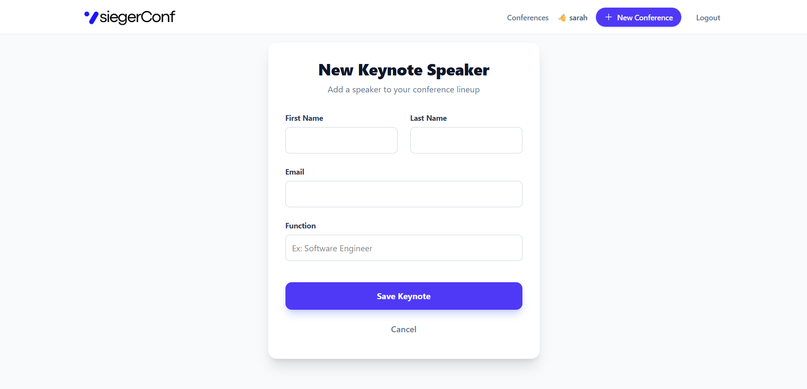
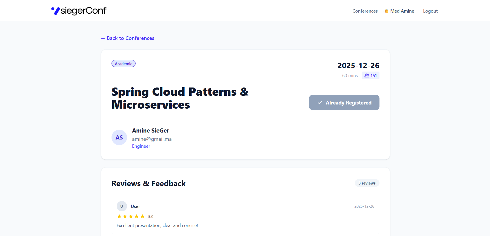
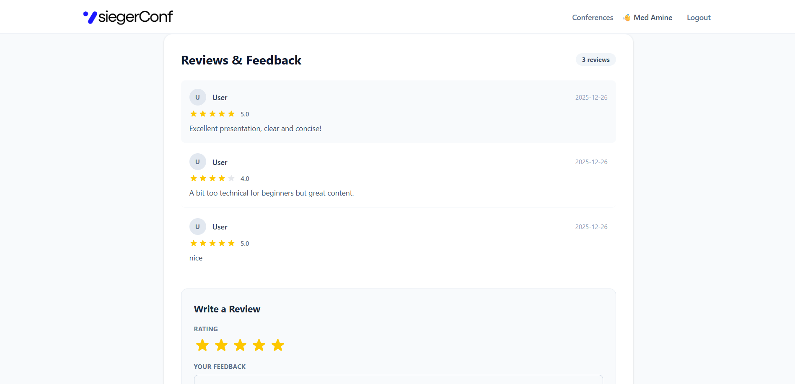
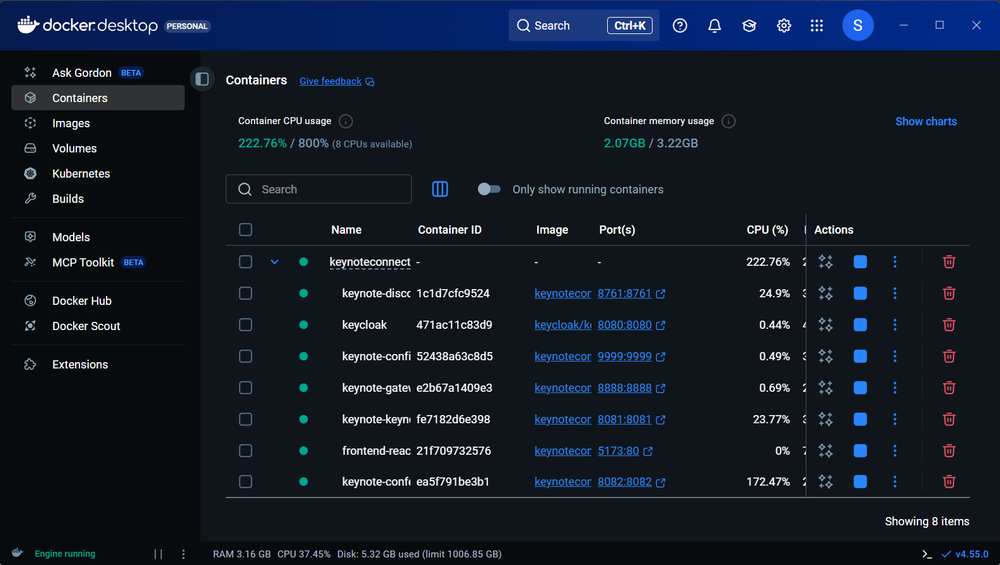
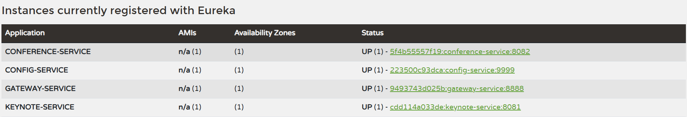

   

   <h1>SiegerConf | Distributed Conference Management System</h1>
   
   

      A cloud-native application built on a Microservices architecture using Spring Boot ecosystem, React, and Docker.
      Designed to handle conference scheduling, speaker management, and attendee reviews with robust security and scalability.
   

   

      <b>DJILI Mohamed Amine</b>
   

<h2>1. System Architecture</h2>

The platform relies on a decoupled architecture where each domain is isolated in its own deployable unit. The system utilizes the **Discovery Pattern** for service location and an **API Gateway** for routing and cross-cutting concerns (CORS, Security).

<h3>Core Components</h3>

<ul>
  <li><strong>API Gateway (Spring Cloud Gateway):</strong> The single entry point for all client requests. It handles routing to backend services and integrates with the Discovery Service.</li>
  <li><strong>Discovery Service (Netflix Eureka):</strong> Service registry that allows microservices to locate each other dynamically without hardcoded hostnames.</li>
  <li><strong>Config Service (Spring Cloud Config):</strong> Centralized configuration management for all microservices.</li>
  <li><strong>Identity Provider (Keycloak):</strong> Manages OAuth2 / OpenID Connect (OIDC) authentication and authorization. Handles RBAC (Role-Based Access Control) for <code>ADMIN</code> and <code>USER</code> roles.</li>
  <li><strong>Functional Services:</strong>
    <ul>
      <li><code>keynote-service</code>: Manages speaker profiles and details.</li>
      <li><code>conference-service</code>: Handles event scheduling and attendee registration.</li>
    </ul>
  </li>
  <li><strong>Frontend (React):</strong> A modern Single Page Application (SPA) consuming APIs via the Gateway.</li>
</ul>

<h2>2. Technical Stack</h2>

<table>
  <thead>
    <tr>
      <th>Category</th>
      <th>Technology</th>
    </tr>
  </thead>
  <tbody>
    <tr>
      <td><strong>Backend Framework</strong></td>
      <td>Java 21, Spring Boot 4.0.1</td>
    </tr>
    <tr>
      <td><strong>Microservices</strong></td>
      <td>Spring Cloud Gateway, Eureka, Config Server</td>
    </tr>
    <tr>
      <td><strong>Security</strong></td>
      <td>Spring Security, OAuth2 Resource Server, Keycloak 26 (Dockerized)</td>
    </tr>
    <tr>
      <td><strong>Frontend</strong></td>
      <td>React 18, Vite, Tailwind CSS, Axios</td>
    </tr>
    <tr>
      <td><strong>Database</strong></td>
      <td>H2 (In-Memory for Dev), PostgreSQL (Production ready)</td>
    </tr>
    <tr>
      <td><strong>Infrastructure</strong></td>
      <td>Docker, Docker Compose, Nginx</td>
    </tr>
  </tbody>
</table>

<h2>3. Application Features & Interface</h2>

<h3>User Experience & Authentication</h3>

The application supports public browsing with restricted access for interactive features. Authentication is delegated to Keycloak.

<table width="100%">
  <tr>
    <td width="50%">
      <strong>Public Landing Page</strong> 
      Access to conference lists without authentication.  
      
    </td>
    <td width="50%">
      <strong>Authentication Flow</strong> 
      Secure login via Keycloak (OAuth2 Authorization Code Flow).  
      
    </td>
  </tr>
</table>

<h3>Administrative Capabilities</h3>

Users with the <code>ADMIN</code> role have exclusive access to write operations (Create/Update/Delete).

<table width="100%">
  <tr>
    <td width="50%">
      <strong>Conference Management</strong> 
      Admins can schedule new conferences and link them to speakers.  
      
    </td>
    <td width="50%">
      <strong>Keynote/Speaker Management</strong> 
      Dedicated interface for managing speaker profiles.  
      
    </td>
  </tr>
</table>

<h3>Attendee Interaction</h3>

Authenticated users can view details, register for events, and leave feedback.

<table width="100%">
  <tr>
    <td width="50%">
      <strong>Conference Details & Reviews</strong> 
      Users can read descriptions and see existing ratings.  
      
    </td>
    <td width="50%">
      <strong>Submission Interface</strong> 
      Interactive form for submitting star ratings and text feedback.  
      
    </td>
  </tr>
</table>

<h2>4. Infrastructure & Deployment</h2>

The entire infrastructure is containerized. Services are orchestrated using Docker Compose, ensuring consistent environments between development and production.

<h3>Service Registry & Containerization</h3>

<table width="100%">
  <tr>
    <td width="50%">
      <strong>Docker Infrastructure</strong> 
      Dashboard showing healthy containers for Keycloak, Databases, and Spring Boot Services.  
      
    </td>
    <td width="50%">
      <strong>Service Discovery (Eureka)</strong> 
      Live view of registered instances available for load balancing.  
      
    </td>
  </tr>
</table>

<h2>5. Installation & Setup</h2>

<h3>Prerequisites</h3>
<ul>
  <li>Docker & Docker Compose</li>
  <li>Java JDK 17+</li>
  <li>Node.js 18+ (for local frontend development)</li>
</ul>

<h3>Deployment Steps</h3>

1. <strong>Clone the repository</strong>

<pre><code>git clone https://github.com/SieGer05/KeynoteConnect.git
cd keynote-connect</code></pre>

2. <strong>Build the Microservices</strong>

<pre><code># Run Maven build for all services (skipping tests for speed)
./mvnw clean package -DskipTests</code></pre>

3. <strong>Launch with Docker Compose</strong>

<pre><code>docker compose up -d --build</code></pre>

<em>Note: Allow approx. 40-60 seconds for Keycloak and the Config Server to fully initialize.</em>

4. <strong>Access the Application</strong>

<ul>
  <li><strong>Frontend:</strong> <code>http://localhost:5173</code></li>
  <li><strong>Keycloak Console:</strong> <code>http://localhost:8080</code> (Default creds: <code>admin/admin</code>)</li>
  <li><strong>Eureka Dashboard:</strong> <code>http://localhost:8761</code></li>
</ul>

<footer>
  
&copy; 2025 SiegerConf Project | University Project - 2025

</footer>